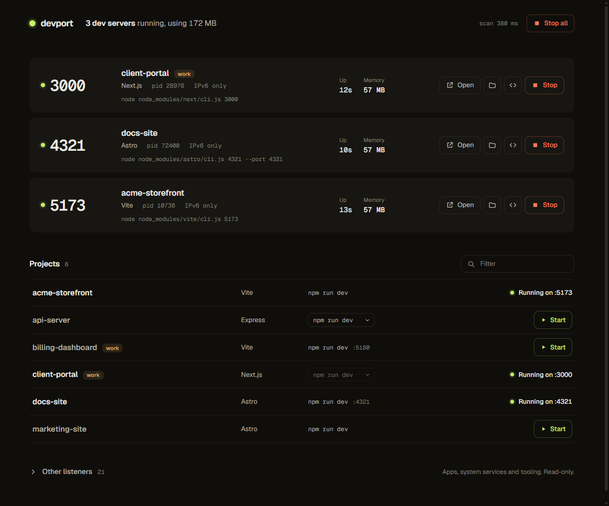

# devport

See every dev server running on your Windows machine, which project it belongs to, and start, stop or tail them in one click.



You start `npm run dev` in one terminal, a Python server in another, forget about both, and two days later port 5173 is taken and something on 3000 is eating 400 MB. devport is a small local dashboard that answers "what is running, and from where?" without `netstat` and Task Manager.

## What it shows

- **Every listening dev server.** It scans all ports, not a fixed list, and refreshes every 3 seconds. It pauses while the tab is hidden.
- **The project it came from.** The repo folder is read from the process command line, so `...\projects\acme-storefront\node_modules\vite\bin\vite.js` shows as **acme-storefront**.
- **The stack.** Vite, Astro, Next.js, Nuxt, Remix, Angular, Webpack, Wrangler, Netlify Dev, `serve`, `http-server`, nodemon, tsx, Python `http.server`, Uvicorn, Flask, Django, Laravel, PHP's built-in server and Rails.
- **Uptime and memory.** Servers running for hours or using a lot of memory are highlighted (see [Zombie alerts](#zombie-alerts)).
- **Binding.** `localhost`, `IPv6 only` (`::1`, where `127.0.0.1` won't connect) or `LAN visible` (reachable from other devices on your network).
- **Actions.** Open in the browser, open the folder in Explorer, open it in VS Code, **Stop**, and **Stop all**. Stopping takes a second click to confirm and ends the whole process tree.

## Starting projects

Below the running servers, **Projects** lists every repo in your projects folder that has a `dev`, `start` or `serve` script in its `package.json`. Click **Start** and devport runs that script in a hidden window. The row shows **Starting** until the server begins listening, then **Running on :port**, and the server appears in the list above.

- **Pick the script.** If a project has more than one of `dev`, `start` and `serve`, choose which to run. A `--port` in the script is shown next to it, and devport refuses to start when that port is already taken.
- **Uses your package manager.** pnpm, yarn or bun when their lockfile is present, npm otherwise.
- **No `node_modules`?** The row says to install first instead of starting something that will fail.
- **When it fails,** the row turns red with the last lines of output and the path to the full log (`%LOCALAPPDATA%\devport\logs`). The same happens if nothing is listening after 2 minutes.
- **Servers with no path in their command** (`node server.js`) are still matched to their project, because devport remembers which processes it started.
- **Filter** the list by name or stack. Type `work` to see only work repos.

Only those three script names can be run, and only for projects found in the projects folder. devport never runs arbitrary commands from the browser.

## Logs

Servers started from devport get a **Logs** button. It opens the server's output inside its row and keeps following it live, about once a second. Scroll up and following pauses; scroll back to the bottom (or tick **Follow**) to resume. Errors are tinted, colour codes are stripped, and the log file's path is shown so you can open it in your editor.

Logs live in `%LOCALAPPDATA%\devport\logs` and are deleted after 7 days. Servers you started yourself in a terminal have no Logs button, because their output goes to that terminal, not to devport.

## Tray icon

While devport runs, an icon by the clock shows how many dev servers are running: a lime dot with the count, or an empty ring when nothing is. Hover it for the count and total memory.

- **Left-click** opens the dashboard.
- **Right-click** lists each running server (click one to open it), plus **Open dashboard**, **Stop all dev servers** (asks first) and **Quit devport**, which stops the dashboard but leaves your servers running.

The icon closes by itself when devport stops. Windows may put new icons in the hidden-icons overflow (the `^` by the clock); drag it onto the taskbar to keep it visible. Set `DEVPORT_TRAY=0` to run without it.

## Zombie alerts

devport flags dev servers that look forgotten or heavy:

- **Forgotten:** running for more than 8 hours.
- **Heavy:** using more than 1 GB of memory.

Flagged servers get an amber dot and an amber uptime or memory figure in the dashboard, and a note in the tray menu. The tray also raises a Windows notification, once per server per reason, so a server that stays heavy doesn't nag you. Several at once are batched into one notification. Click it to open the dashboard.

Windows' Do Not Disturb hides the pop-up but still keeps the notification in the notification centre (Win+N).

Change the limits with `DEVPORT_STALE_HOURS` and `DEVPORT_MEM_MB`. Set either to `0` to turn that check off, or `DEVPORT_ALERTS=0` to keep the highlights but skip notifications.

Everything else listening on your machine (system services, Steam, Zoom, editor extensions, AI tools) is listed under **Other listeners**, read-only. devport only stops processes running on a dev runtime (`node`, `python`, `php`, `bun`, `deno`, `ruby`). It never stops:

- Windows services or desktop apps
- editor extension hosts (VS Code, Cursor)
- MCP servers and agent tooling (Hermes, Antigravity)
- itself

## Requirements

- Windows 10 or 11 (it uses `netstat`, `taskkill` and PowerShell's CIM)
- Node.js 20 or newer
- No dependencies, no install step

## Run it

```bash
git clone https://github.com/kingspast21/devport.git
cd devport
npm start
```

Then open http://localhost:7777.

### Options

| Variable | Default | What it does |
|---|---|---|
| `DEVPORT_PORT` | `7777` | Port the dashboard listens on |
| `DEVPORT_ROOT` | `~/projects` | Folder your repos live in |
| `DEVPORT_TRAY` | `1` | Set to `0` to skip the tray icon |
| `DEVPORT_STALE_HOURS` | `8` | Hours before a server counts as forgotten (`0` = off) |
| `DEVPORT_MEM_MB` | `1024` | Memory in MB before a server counts as heavy (`0` = off) |
| `DEVPORT_ALERTS` | `1` | Set to `0` to skip Windows notifications |

Repos directly inside the root are listed by folder name. Repos inside a `work` subfolder (`~/projects/work/<repo>`) get a **work** tag, which helps keep client or employer projects apart. A server whose path is outside the root is still detected, from the folder that holds its `node_modules`, and is tagged **outside projects**.

## How it works

1. `netstat -ano` lists listening TCP ports and their process IDs.
2. A long-lived PowerShell worker asks CIM (`Win32_Process`) for each process's command line, start time and memory. Reusing one worker keeps a scan to about half a second after the first one.
3. `lib/classify.js` sorts each process into dev server, tooling, app or system, and works out the repo and stack. It is pure and covered by tests: `npm test`.
4. Before stopping or opening anything, the server scans again and only acts on a PID that is still a dev server, so a recycled PID can't be hit by mistake.
5. **Start** runs `<pm> run <script>` through PowerShell's `Start-Process -WindowStyle Hidden`, with output redirected to a log file. The launch's process ID is remembered so any server it spawns is matched to the project.

## Security

devport can end processes, so it is locked down:

- It binds to `127.0.0.1` only.
- Requests with a foreign `Host` header are refused, which blocks DNS rebinding.
- Every action needs a same-origin request with a custom header, so other websites can't trigger it.

There is no auth beyond that. Don't expose it on a network.

## Limits

- **Windows only** for now. macOS and Linux would need `lsof`/`ss` and `ps` in `lib/scan.js`. PRs welcome.
- **Repos are found from the command line.** A server started outside devport with no path in its arguments (for example `python -m http.server` run from inside the repo) shows as **Unknown repo**, because Windows doesn't expose another process's working directory without native code.
- **Projects means Node projects.** Folders without a `package.json` (static sites, Laravel, Django) aren't listed under Projects yet, though their servers are still detected when running.
- **Launch tracking lives in memory.** Restarting devport forgets which servers it started, so a pathless `node server.js` it launched earlier shows as **Unknown repo** after a restart.
- **Open in VS Code** expects the default user install of VS Code.

## License

MIT
